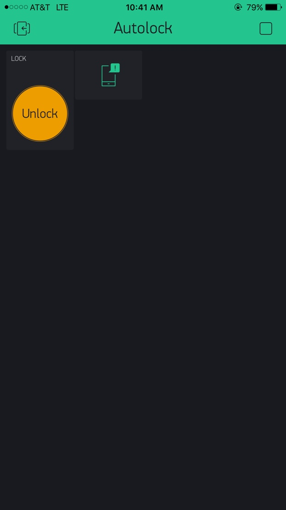

# iLock
node js codes/hardware wirings for locking/unlocking via Blynk and Raspberry Pi

A live demo can be found [here](https://drive.google.com/open?id=0B-pWbVM_9FQXREQ5ZGFyTERVVFk).

Step by step guide:


1. Hardware
  * [Raspberry Pi Complete Starter Kit](https://www.canakit.com/raspberry-pi-3-starter-kit.html)
  * [Towerpro MG995R or MG996R Servo](https://hobbyking.com/en_us/towerpro-mg996r-10kg-servo-10kg-0-20sec-55g.html)
  * LEDs, jumpwires, resistors etc.
  
2. Software
  * [Blync](http://www.blynk.cc): download to your smartphone and check their [Youtube channel](https://www.youtube.com/channel/UCKWBP3MdpMQFdOCQ63mhC_Q) for how to set up a Blync app
  * Node js: run following commands to download codes to your Raspberry Pi terminal
  
  ```shell
  git clone https://github.com/labrook/iLock.git  
  cd iLock/  
  sudo npm install
  ```
 
3. Circuit: refer to the following figures for wirings
  * LED/Button wiring diagram - _Note that the LED pin number is changed from 17 to 26 for easy wiring_
  
  
  
  * Servo wiring diagram - _Note that the LED pin number is changed from 17 to 26 for easy wiring_
  
  
  
4. Power and Run!
  * Power your Raspberry Pi and start the service from the terminal
  
  ```shell
  suod node doorlock.js
  ```
  * Play from your phone
  
  

  
  
  
